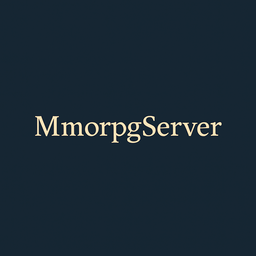

# MmorpgServer

<div align="center">
    
</div>

## 🧩 프로젝트 개요

MmorpgServer는 C++17 기반의 MMORPG 서버 구현 프로젝트입니다. Windows 환경에서 IOCP 기반 고성능 네트워크 서버를 설계하고, Job Queue 시스템과 멀티스레드 기반의 작업 분리를 통해 실제 온라인 게임 환경과 유사한 서버 구조를 구현하는 것을 목표로 합니다.

이 프로젝트는 다음과 같은 기술 역량을 포트폴리오로 보여주기 위한 목적으로 진행됩니다:

* Windows IOCP 기반 서버 구조 설계
* 멀티스레드/비동기 작업 처리 설계 (IO-bound vs CPU-bound 분리)
* C++17을 활용한 구조적 설계 및 현대적 문법 적용
* 향후 데이터베이스, 인증, 게임 콘텐츠까지 포함한 실전 서버 기능 구현

---

## 📁 프로젝트 구조

```bash
MmorpgServer/
├── ServerEngine/     # 공용 Concurrency/Io/Job/Log/Network 엔진 모듈
├── GameServer/       # 서버 실행 본체, 메인 루프, 패킷 핸들러, 서버 초기화
├── GameContent/      # 게임 컨텐츠 모듈
├── DummyClient/      # 테스트용 더미 클라이언트 구현
├── Common/Protocol/  # Protobuf 정의 (패킷의 페이로드 구조 정의)
├── Tools/PacketGenerator/ # 패킷 코드 자동 생성 도구
└── vcpkg.json        # 의존성 패키지 관리
```

---

## 🧪 주요 설계 포인트

* **IOCP 기반 비동기 입출력 처리**: Windows I/O Completion Port를 활용한 고성능 입출력 처리
* **Job Queue 구조 도입**: IO 작업과 CPU 작업을 명확히 분리하여 스레드 부하를 효율적으로 분산
* **패킷 자동화 생성**: `Common/Protocol/*.proto` 정의 후, `Tools/PacketGenerator/GenPacket.bat` 실행 시 핸들러 코드 자동 생성

---

## 🛠️ 사용 기술 스택

* **Language**: C++17
* **Platform**: Windows 11 64bit
* **IDE**: Visual Studio 2022
* **Package manager**: vcpkg manifest mode(`vcpkg install --triplet x64-windows-static` → 모든 패키지 설치)
* **Serialization**: [protobuf](https://github.com/protocolbuffers/protobuf) (`.proto` → 자동 핸들러 생성)
* **Logging**: [spdlog](https://github.com/gabime/spdlog)
* **Memory allocator**: [mimalloc](https://github.com/microsoft/mimalloc)
* **Lock-free queue**: [concurrentqueue](https://github.com/cameron314/concurrentqueue)

---

## 🚀 빌드 및 실행

Visual Studio 2022에서 MmorpgServer.sln 열기 → 빌드 및 실행

---

## 📜 라이선스

본 프로젝트는 학습 및 포트폴리오 목적으로 사용됩니다.

> ⚠️ 본 README는 프로젝트 진행 중 지속적으로 업데이트됩니다. 최신 상태는 커밋 기록과 함께 확인해주세요.

---
